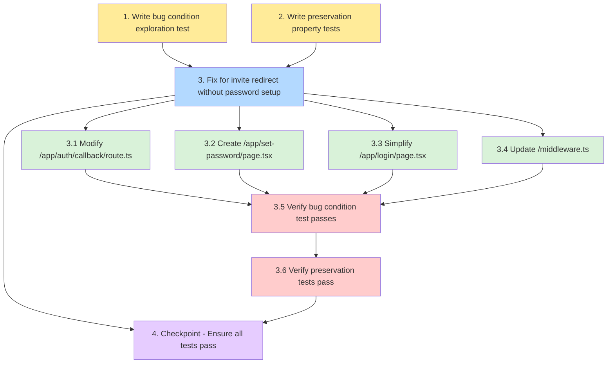

# Implementation Plan

## Overview

This implementation plan follows the bugfix workflow for the invite redirect issue. The plan addresses the bug where invited users are immediately redirected to role-based destinations without being prompted to set their password first. The fix introduces first-time login detection in `/auth/callback`, creates a new `/set-password` page for password setup, simplifies the login page to password-only authentication, and updates middleware to allow access to the password setup flow.

The implementation follows three phases:
1. **Exploration** - Write tests BEFORE the fix to understand and document the bug
2. **Preservation** - Write tests to capture existing behavior that must not change
3. **Implementation** - Apply the fix with understanding from exploration

## Tasks

- [x] 1. Write bug condition exploration test
  - **Property 1: Bug Condition** - First-Time Invite Redirect Without Password Setup
  - **CRITICAL**: This test MUST FAIL on unfixed code - failure confirms the bug exists
  - **DO NOT attempt to fix the test or the code when it fails**
  - **NOTE**: This test encodes the expected behavior - it will validate the fix when it passes after implementation
  - **GOAL**: Surface counterexamples that demonstrate the bug exists
  - **Scoped PBT Approach**: For deterministic bugs, scope the property to the concrete failing case(s) to ensure reproducibility
  - Test implementation details from Bug Condition in design:
    - Test super_admin invite: Send invite → Click link → Assert redirects to `/set-password` with destination parameter (NOT directly to `/projects`)
    - Test team_member invite: Send invite → Click link → Assert redirects to `/set-password` with destination parameter (NOT directly to `/projects`)
    - Test client invite: Send invite with projectId → Click link → Assert redirects to `/set-password` with destination parameter (NOT directly to `/analytics/[id]`)
  - The test assertions should match the Expected Behavior Properties from design:
    - Assert redirect URL contains `/set-password`
    - Assert redirect URL contains `destination=` query parameter with role-based URL
    - Assert user cannot access role-based destinations until password is set
  - Run test on UNFIXED code
  - **EXPECTED OUTCOME**: Test FAILS (this is correct - it proves the bug exists)
  - Document counterexamples found to understand root cause:
    - "super_admin invite redirects directly to `/projects` instead of `/set-password`"
    - "team_member invite redirects directly to `/projects` instead of `/set-password`"
    - "client invite redirects directly to `/analytics/[id]` instead of `/set-password`"
    - "No password setup flow is triggered for first-time logins"
  - Mark task complete when test is written, run, and failure is documented
  - _Requirements: 2.1, 2.2, 2.3, 2.4_

- [x] 2. Write preservation property tests (BEFORE implementing fix)
  - **Property 2: Preservation** - Existing Login Flow and RBAC Behavior
  - **IMPORTANT**: Follow observation-first methodology
  - Observe behavior on UNFIXED code for non-buggy inputs (existing users with passwords):
    - Observe: super_admin with password logs in → redirects to `/projects`
    - Observe: team_member with password logs in → redirects to `/projects`
    - Observe: client with password logs in → redirects to `/analytics/[id]`
    - Observe: client invite acceptance → `project_assignments` row is created
    - Observe: team_member invite acceptance → profile created with role `team_member`
    - Observe: middleware enforces role-based access control correctly
  - Write property-based tests capturing observed behavior patterns from Preservation Requirements:
    - For all existing users (NOT first-time invites), assert redirect to role-based destination
    - For all client invites, assert `project_assignments` row creation with correct `user_id` and `project_id`
    - For all team_member invites, assert profile creation with role `team_member`
    - For all authenticated sessions, assert middleware enforces RBAC rules
  - Property-based testing generates many test cases for stronger guarantees:
    - Generate test cases across different roles (super_admin, team_member, client)
    - Generate test cases with different project assignments
    - Generate test cases with different authentication states
  - Run tests on UNFIXED code
  - **EXPECTED OUTCOME**: Tests PASS (this confirms baseline behavior to preserve)
  - Mark task complete when tests are written, run, and passing on unfixed code
  - _Requirements: 3.1, 3.2, 3.3, 3.4, 3.5, 3.6_

- [x] 3. Fix for invite redirect without password setup

  - [x] 3.1 Modify `/app/auth/callback/route.ts` to detect first-time logins
    - Add first-time login detection after fetching user and profile
    - Check if user needs password setup: `const needsPasswordSetup = !user.user_metadata?.password_set`
    - **Security Note**: Using `user_metadata.password_set` (user-writable) for now — acceptable risk for internal tool. Revisit if hardening security later (migrate to `app_metadata` or check auth factors directly)
    - Determine intended destination based on role:
      - super_admin → `/projects`
      - team_member → `/projects`
      - client → `/analytics/${projectIds[0]}`
    - Redirect to `/set-password?destination=${encodeURIComponent(intendedDestination)}` if password setup is needed
    - Preserve all existing logic for users with passwords (role-based redirection)
    - Preserve all existing profile fetching, retry logic, and project_assignments creation
    - _Bug_Condition: isBugCondition(input) where input.user.isFirstTimeLogin AND NOT input.user.hasPasswordSet_
    - _Expected_Behavior: Redirect to `/set-password` with destination parameter for first-time logins (from design section "Expected Behavior")_
    - _Preservation: Existing login flow, role-based redirection, and invite metadata handling (from design section "Preservation Requirements")_
    - _Requirements: 2.1, 2.2, 2.3, 2.4, 3.1, 3.2, 3.3, 3.4, 3.5, 3.6_

  - [x] 3.2 Create `/app/set-password/page.tsx` for password setup flow
    - Create new page component for password setup
    - Display user's email (read-only) fetched from session
    - Provide password and confirm password input fields
    - Validate password strength (minimum 8 characters)
    - Validate passwords match before submission
    - Call Supabase `updateUser()` API on form submission:
      ```typescript
      const { error } = await supabase.auth.updateUser({
        password: newPassword,
        data: { password_set: true }
      })
      ```
    - Handle errors from Supabase (weak password, network issues)
    - After successful password update, validate and redirect to destination:
      - Read `destination` query parameter
      - Validate destination: must start with `/`, must NOT start with `//`, must NOT contain protocol (`http://` or `https://`)
      - If validation fails or destination is missing, fall back to `/projects`
      - Redirect to validated destination
    - Use dark theme and styling consistent with login page (dark background, gradient blobs, card layout)
    - _Bug_Condition: User needs to set password before accessing role-based destinations_
    - _Expected_Behavior: Password setup page allows user to establish credentials and redirects to intended destination_
    - _Preservation: No impact on existing flows (new page only accessed by first-time logins)_
    - _Requirements: 2.1, 2.2, 2.3, 2.5_

  - [x] 3.3 Simplify `/app/login/page.tsx` to password-only authentication
    - Remove tab switcher UI (remove `tab` state and tab button elements)
    - Remove magic link authentication handler (`handleMagicLink()` function)
    - Always show email and password input fields (remove conditional rendering)
    - Remove magic link description text ("We'll email you a one-time sign-in link")
    - Update submit button to always call `handlePassword()` and display "Sign In"
    - Preserve all email/password authentication logic
    - Preserve error handling, success messages, and loading states
    - Preserve UI styling and layout (dark theme, gradient background, card layout)
    - Preserve keyboard shortcuts (Enter key to submit)
    - _Bug_Condition: N/A (simplification, not directly related to bug)_
    - _Expected_Behavior: Login page uses password-only authentication_
    - _Preservation: Existing email/password login flow remains functional_
    - _Requirements: 3.1, 3.2, 3.3_

  - [x] 3.4 Update `/middleware.ts` to allow `/set-password` access
    - Add `/set-password` to `PUBLIC_ROUTES` constant
    - Update `PUBLIC_ROUTES` definition: `const PUBLIC_ROUTES = new Set(['/login', '/auth/callback', '/set-password']);`
    - Preserve all existing role-based access control logic
    - Preserve middleware enforcement of RBAC policies
    - _Bug_Condition: Authenticated users need to access `/set-password` page_
    - _Expected_Behavior: Middleware allows authenticated users to access `/set-password`_
    - _Preservation: All existing RBAC enforcement remains unchanged_
    - _Requirements: 2.1, 2.2, 2.3, 3.6_

  - [x] 3.5 Verify bug condition exploration test now passes
    - **Property 1: Expected Behavior** - First-Time Invite Triggers Password Setup
    - **IMPORTANT**: Re-run the SAME test from task 1 - do NOT write a new test
    - The test from task 1 encodes the expected behavior
    - When this test passes, it confirms the expected behavior is satisfied
    - Run bug condition exploration test from step 1
    - **EXPECTED OUTCOME**: Test PASSES (confirms bug is fixed)
    - Verify all three test cases pass:
      - super_admin invite redirects to `/set-password` with correct destination
      - team_member invite redirects to `/set-password` with correct destination
      - client invite redirects to `/set-password` with correct destination
    - Verify password setup flow works end-to-end:
      - User can set password on `/set-password` page
      - After password setup, user is redirected to role-based destination
    - _Requirements: 2.1, 2.2, 2.3, 2.4, 2.5_

  - [x] 3.6 Verify preservation tests still pass
    - **Property 2: Preservation** - Existing Flows Unchanged
    - **IMPORTANT**: Re-run the SAME tests from task 2 - do NOT write new tests
    - Run preservation property tests from step 2
    - **EXPECTED OUTCOME**: Tests PASS (confirms no regressions)
    - Verify all preservation test cases pass:
      - Existing users with passwords redirect to role-based destinations
      - Client invites create `project_assignments` rows correctly
      - Team member invites create profiles with role `team_member`
      - Middleware enforces RBAC rules correctly
    - Confirm all tests still pass after fix (no regressions)
    - _Requirements: 3.1, 3.2, 3.3, 3.4, 3.5, 3.6_

- [x] 4. Checkpoint - Ensure all tests pass
  - Run all exploration tests (task 1) - should PASS on fixed code
  - Run all preservation tests (task 2) - should still PASS on fixed code
  - Verify end-to-end flow works for all roles:
    - super_admin invite → set password → access `/projects`
    - team_member invite → set password → access `/projects`
    - client invite → set password → access `/analytics/[id]`
  - Verify existing login flows work:
    - super_admin with password → login → access `/projects`
    - team_member with password → login → access `/projects`
    - client with password → login → access `/analytics/[id]`
  - Verify RBAC enforcement still works correctly
  - Ensure all tests pass, ask the user if questions arise

## Task Dependency Graph

```json
{
  "waves": [
    {
      "name": "Wave 1: Exploration & Preservation Testing",
      "tasks": ["1", "2"],
      "description": "Write bug condition exploration test and preservation property tests BEFORE implementing the fix"
    },
    {
      "name": "Wave 2: Implementation",
      "tasks": ["3.1", "3.2", "3.3", "3.4"],
      "description": "Implement the fix across all affected files"
    },
    {
      "name": "Wave 3: Verification",
      "tasks": ["3.5", "3.6"],
      "description": "Verify bug condition test passes and preservation tests still pass"
    },
    {
      "name": "Wave 4: Checkpoint",
      "tasks": ["4"],
      "description": "Final checkpoint to ensure all tests pass"
    }
  ]
}
```


**Legend:**
- Yellow: Exploration tests (before fix)
- Light Yellow: Preservation tests (before fix)
- Light Blue: Implementation parent task
- Light Green: Implementation sub-tasks
- Light Red: Verification sub-tasks
- Light Purple: Checkpoint

**Critical Path:**
1. Task 1 (exploration test) must complete before Task 3 (implementation)
2. Task 2 (preservation tests) must complete before Task 3 (implementation)
3. Tasks 3.1-3.4 (implementation sub-tasks) can be done in parallel
4. Task 3.5 (verify bug fix) depends on all implementation sub-tasks
5. Task 3.6 (verify preservation) depends on Task 3.5
6. Task 4 (checkpoint) depends on Task 3.6

## Notes

### Security Considerations

- **user_metadata.password_set Flag**: The current implementation uses `user.user_metadata?.password_set` (user-writable metadata) to detect first-time logins. For this internal tool, the risk is acceptable. If security hardening is needed later, consider migrating to `app_metadata` (admin-only) or checking password authentication factors directly.

- **Destination Parameter Validation**: The `/set-password` page MUST validate the destination parameter to prevent open redirect vulnerabilities. Valid destinations must:
  - Start with `/` (relative path)
  - NOT start with `//` (protocol-relative URL)
  - NOT contain `http://` or `https://` (absolute URL)
  - Fall back to `/projects` if validation fails

### Testing Notes

- **Exploration Test Expectations**: Task 1 tests MUST FAIL on unfixed code. This failure confirms the bug exists and is NOT a test error. Do not attempt to fix the test or code when it fails - document the counterexamples and mark the task complete.

- **Preservation Test Expectations**: Task 2 tests MUST PASS on unfixed code. This confirms the baseline behavior that should be preserved after the fix.

- **Property-Based Testing**: Tasks 1 and 2 use property-based testing to generate many test cases automatically. This provides stronger guarantees than manual unit tests, especially for preservation checking.

### Implementation Notes

- **Password-Only Authentication**: Task 3.3 removes all magic link functionality from the login page, simplifying the authentication system to password-only. This aligns with the new password-first workflow for invited users.

- **Middleware Update**: Task 3.4 adds `/set-password` to the public routes list so authenticated users can access the password setup page without being blocked by RBAC checks.

- **Existing Logic Preservation**: All changes preserve existing profile fetching, retry logic, project_assignments creation for clients, and role-based redirection for users who already have passwords.
